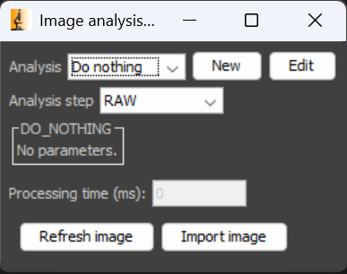
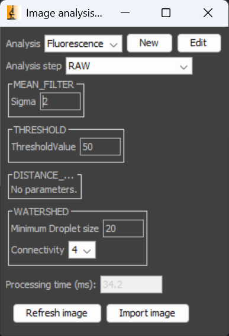
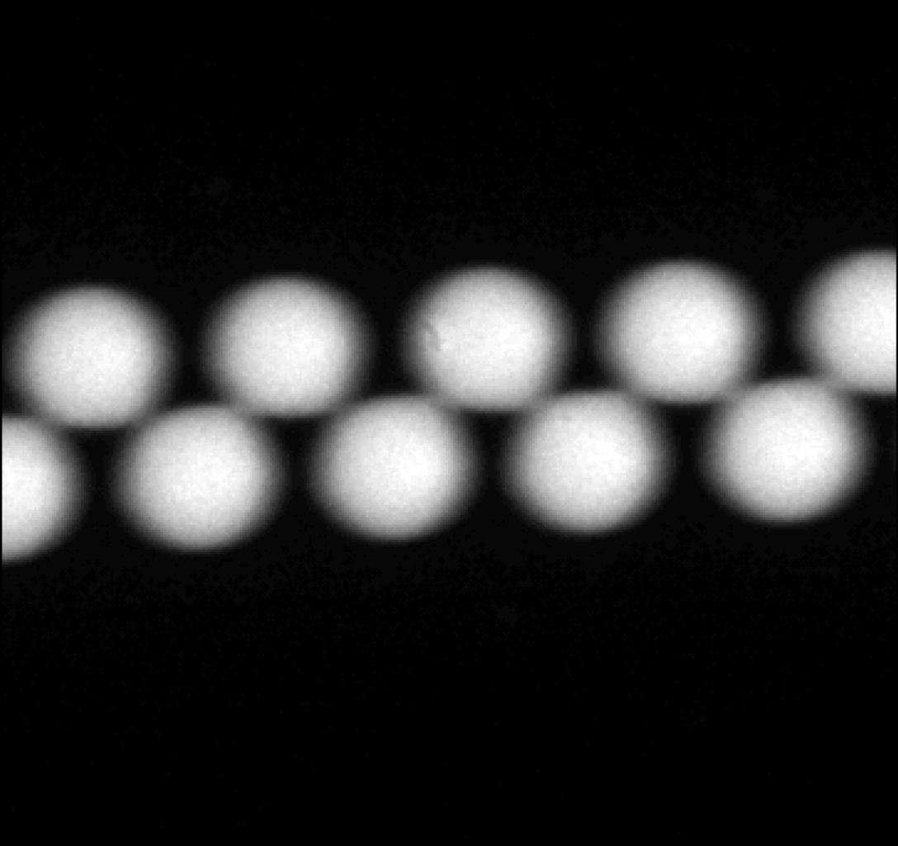
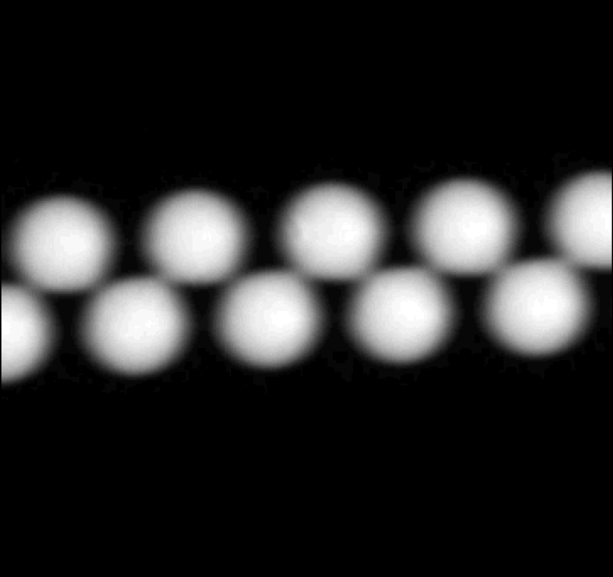
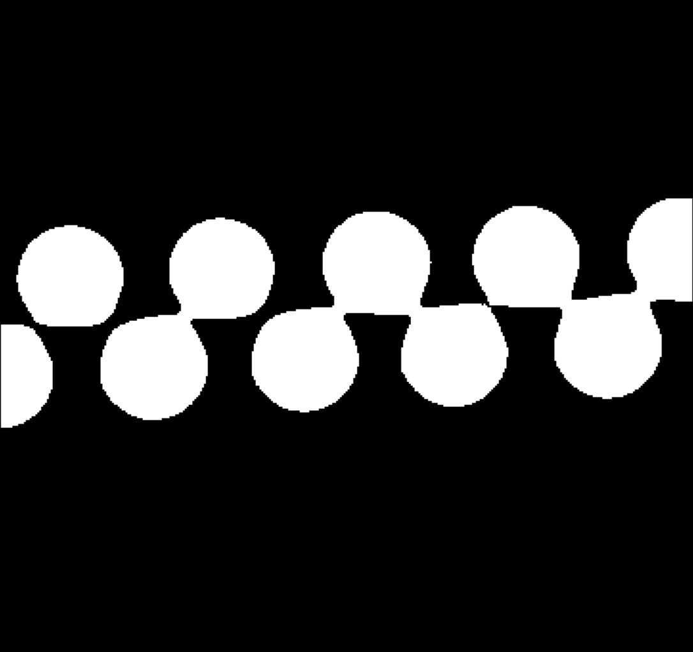
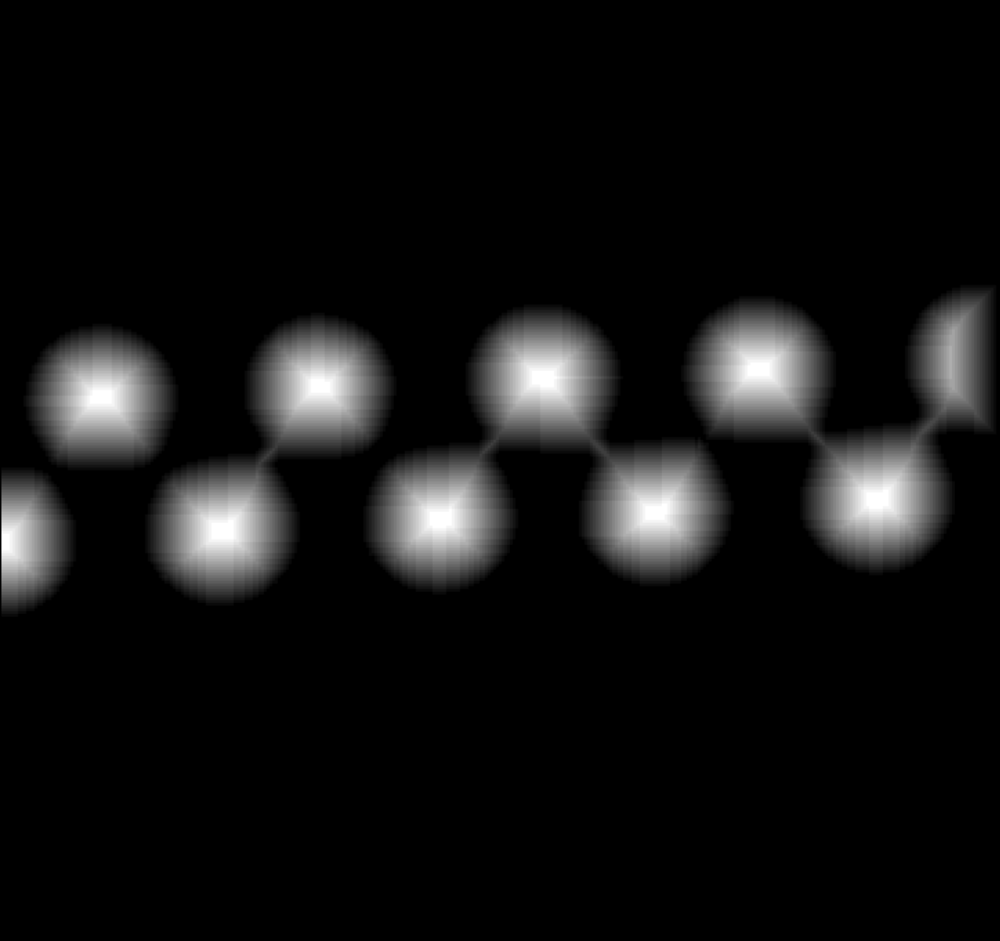
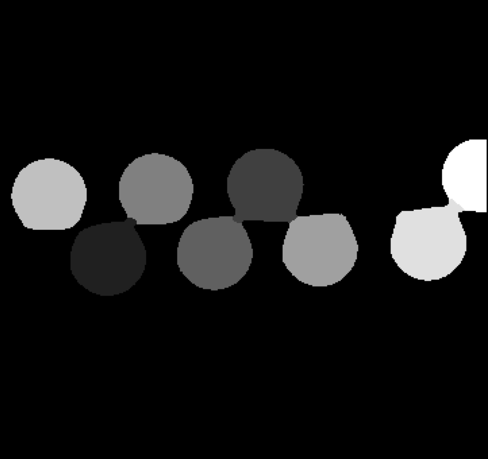
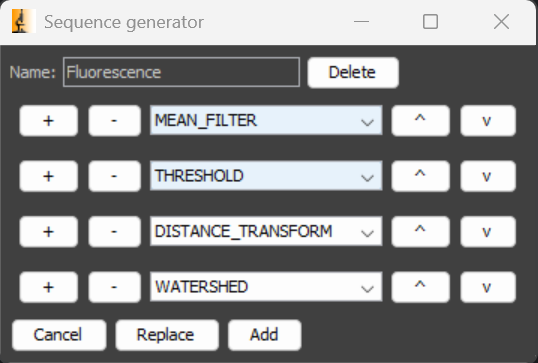

# Real-Time Image Analysis Previewer

<div style="text-align: right">
    <i>By Lars Kool, Institut Pierre-Gilles de Gennes, ESPCI-PSL, Paris, France</i>
</div>

The Real-Time Image Analysis Previewer plugin provides a graphical user interface (GUI) to 
define and test a sequence of image analysis steps. Sequences generated using this plugin can be 
used in other plugins that support these sequences.

## User guide

### Main menu



The main menu lets you select your analysis sequence ("Analysis" dropdown menu), create a new 
sequence ("New" button), or edit the currently selected sequence ("Edit" button). The "Analysis 
step" dropdown lets you select which step of the image analysis you want to visualize, where 
"RAW" selects the unmodified input image, and every other option selects the modified image after 
the corresponding analysis step.

Below that you can find panels with tunable parameters for each of the steps. In the case of the 
Do nothing" step, it indicates that no parameters are needed. Upon changing any parameter, the 
entire image analysis sequence rerun, and the re-analyzed image is shown.

Each analysis is run and timed 10 times, and the average processing time is displayed to give an 
idea about the speed of the sequence. There naturally is some variability in the processing time,
but it should give good approximation.

There are two ways to select an image to analyze. The "Refresh image" button retrieves the last 
captures image of the 'Live' mode (starts 'Live' mode if it is not running). Whereas "Import 
image" allows you to select a locally saved image.



Here you can see a more useful image analysis sequence: a sequence that labels a series of 
bright spots on a dark background, in this case fluorescent droplets suspended in a 
non-fluorescent medium. Which took in total 30-40ms for a 1440x1080 image on my PC (your results 
may vary).

First, a small mean filter is applied to reduce noise.




Next, the image is binarized using a threshold value. Followed by a distance transform.



Lastly, the droplets are segmented and given unique labels using a watershed algorithm.


### Add/Modify sequences

After clicking the "New" or "Edit" button, the Sequence generator will pop up, which allows you 
to create or modify a sequence. Clicking the "+" button will append a new step, the "-" will 
remove that step, the dropdown allows you to choose the analysis performed during that setp, "^" 
moves the step one place up, and "v" moves the step one place down.

After you're done modifying the sequence, you can click "Replace" to replace a sequence with the 
same name, or "Add" to add the sequence to the list of available sequences. Clicking "Delete" at 
the top will remove the sequence from the list of available sequences.

The generated sequences will be available in every plugin that uses this image analysis pipeline.



## Developer guide

### Add analysis algorithms to this plugin

All algorithms are added as static methods of the ImageAnalysis class (analysismanager package). 
They should take at least two arguments (the input image as int[ ] and an inPlace flag whether 
the image should be modified in place, or a copy should be created). The function should return 
the modified image as int[ ] (either the same reference as the input image, or a reference to a 
new copy, depending on the inPlace flag).

To make the new algorithm available to the rest of the system, a couple of things need to be done:
- Add the method to the ```Method``` enum in the ImageAnalysis class (and provide a serializable 
  name).
- Add a case with the corresponding enum entry to the AnalysisStep constructor (each step should 
  know how to initialize itself). Here the required user input parameters (instance of
  AnalysisParameter class) should be provided. For now, 3 types of parameters are supported integers
  and floats as an input textfield and enums as a dropdown menu.
- Add a case with the corresponding enum entry to the AnalysisStep.execute() method (each step 
  should know how to execute itself). There the step should call the algorithm from the
  ImageAnalysis class and provide the correct parameters. Note that the order in which the user 
  input parameters are created in the previous step is the order in which they can be found.

That's all. Your method is now available to be used with other plugins.

## Create applications using the image analysis pipeline

The goal of this plugin is to create one central place to create and debug image analysis 
sequences, and use these sequences across plugins that require RT image analysis.

To add the RT image analysis pipeline to your plugin, you should add the "analysisManager" 
package to your "Root Content" to your project (at least for IntelliJ idea), and add an import 
in the build.xml of your project.

You can create an instance of the AnalysisManager class, which will automatically import the 
"AnalysisSequences.json" file in the main installation folder of Micro-Manager. If the file is 
not present it will create a file with a single "Do nothing" sequence.

There are several QoL classes to simplify the creation of user-interfaces. You can simply add a 
'SequencePanel' to your JPanel/JFrame, which will create a sub-panel for each of the steps, and 
add user-inputs for each of the parameters of each step, and format the input to match 
the expectation of the AnalysisManager. All panels will automatically subscribe to the 
corresponding events, and automatically synchronize between applications.

For any questions, you can contact lars.kool@home.nl